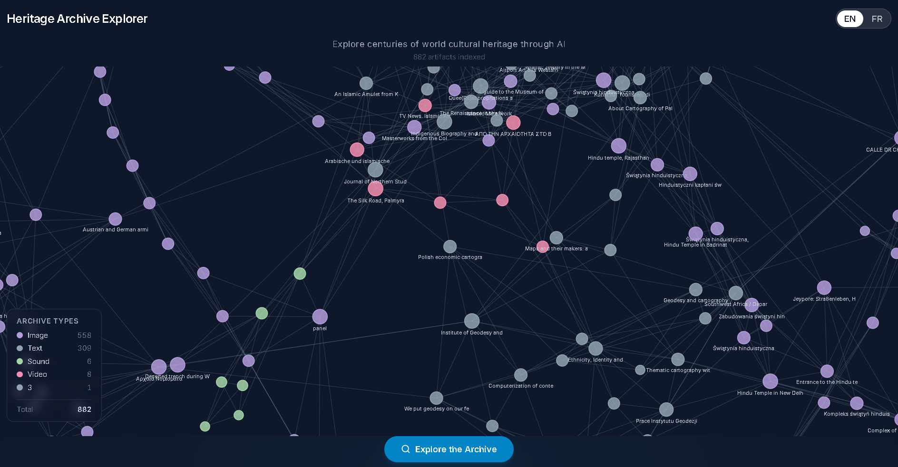
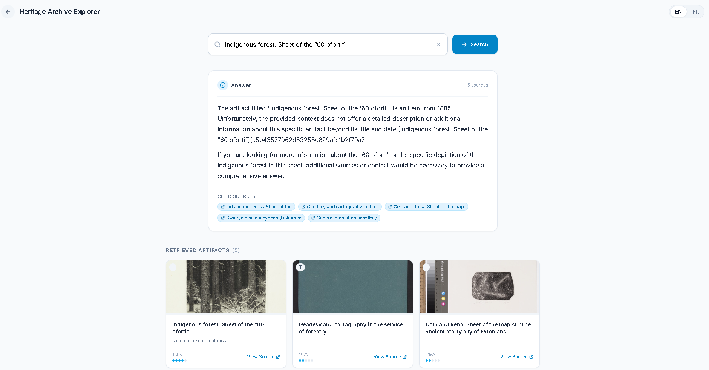
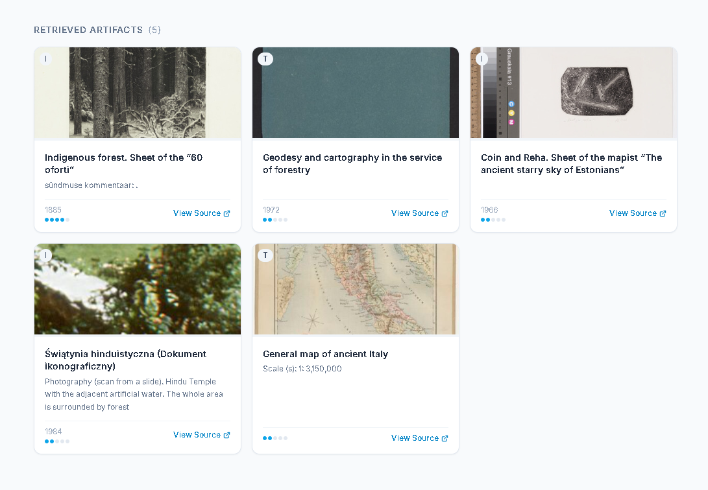
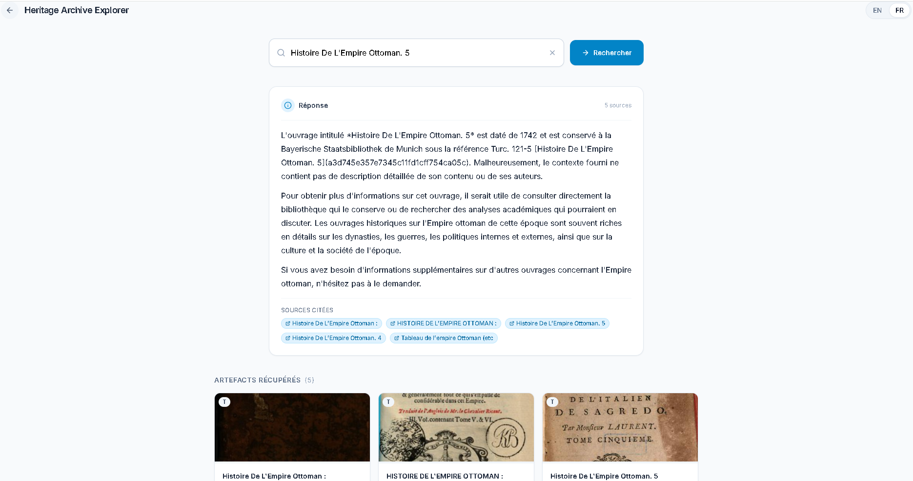
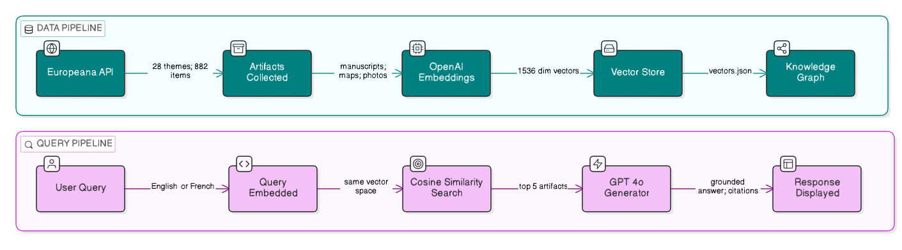

# Heritage Archive Explorer
### Multimodal Retrieval-Augmented Generation for Cultural Heritage Archives

> Hackathon Project · Generative AI · Digital Libraries · UNESCO Alignment

---

## The Problem

Thousands of manuscripts, ancient maps, photographs, and cultural
artifacts have been digitized by institutions worldwide - yet they
remain effectively invisible to the public. Finding anything meaningful
still requires expert knowledge and keyword-based search. A student,
tourist, or researcher cannot simply ask a question and get a
meaningful, cited answer.

As UNESCO's digitization initiative grows, the gap between
"digitized" and "accessible" widens. We built Heritage Archive
Explorer to close that gap.

---

## What We Built

A full-stack intelligent archive assistant that lets anyone ask
natural language questions about a real digitized cultural heritage
collection - in English or French - and receive grounded, cited
answers with actual artifact images shown alongside.

**Key capabilities:**
- Natural language querying across 882+ *real digitized artifacts*
- *Multimodal collection*: manuscripts, maps, photographs, and texts
- Every answer cites its sources - *no fabrication*
- *Bilingual*: English and French supported natively
- Interactive *knowledge graph* showing relationships between artifacts
- AI-generated answers *grounded strictly in retrieved artifacts*
- Clean, professional UI accessible to non-specialist audiences

---

## Live UI

### Knowledge Graph - Explore Before You Search

The landing page shows an interactive D3 force-directed graph of
all 882 artifacts, colored by type and clustered by theme.
Users instantly understand what the archive contains before
typing a single word.



### Intelligent Search - Ask, Retrieve, Cite

Type any question. The system retrieves the 5 most relevant
artifacts using semantic similarity, then generates a grounded
answer with citation chips and artifact cards linking to
original Europeana sources.






### Multilingual Support

Switch between English and French with one click.
The same query returns a response in the selected language,
with no separate translation layer.




---

## How It Works

### Data Pipeline
```
Europeana API (28 cultural heritage queries)
        ↓
882 unique artifacts collected
(title, description, image, type, date, language)
        ↓
OpenAI text-embedding-3-small
converts each artifact into a 1536-dimension semantic vector
        ↓
Vectors stored locally in vectors.json
        ↓
Knowledge graph built from shared themes, types, and time periods
```

### Query Pipeline
```
User question (English or French)
        ↓
Embedded using text-embedding-3-small
        ↓
Cosine similarity search across 882 artifact vectors
        ↓
Top 5 most relevant artifacts retrieved
        ↓
GPT-4o reads only retrieved artifacts and generates cited answer
        ↓
Answer + artifact cards + source links displayed to user
```




---

## Codebase Overview

| File | Purpose |
|---|---|
| `backend/fetch_more.py` | Fetches artifacts from Europeana API across 28 themes |
| `backend/store.py` | Embeds artifact text and saves vectors locally |
| `backend/rag.py` | Core RAG pipeline: retrieval + grounded generation |
| `backend/graph.py` | Builds knowledge graph nodes and edges from artifact data |
| `backend/main.py` | FastAPI server exposing /api/query, /api/graph, /api/health |
| `backend/evaluate.py` | RAGAS-style evaluation on 10 curated test questions |
| `frontend/src/pages/LandingPage.jsx` | D3 knowledge graph landing experience |
| `frontend/src/pages/SearchPage.jsx` | Search interface with answer and artifact cards |
| `frontend/src/components/Graph/` | KnowledgeGraph, Legend, Tooltip components |
| `frontend/src/components/Search/` | SearchBar, AnswerPanel, SourceCard components |

---

## Evaluation Results

We evaluated the RAG pipeline on 10 curated queries covering
all artifact types and both supported languages.

| Metric | Score | What It Means |
|---|---|---|
| Context Recall | 1.00 / 1.00 | Every query successfully retrieved relevant artifacts |
| Source Coverage | 1.00 / 1.00 | All 5 retrieval slots were filled for every query |
| Faithfulness | 0.70 / 1.00 | Answers stay grounded in retrieved sources |
| Answer Relevancy | 0.60 / 1.00 | Answers address the question asked |
| **Overall RAG Score** | **0.82 / 1.00** | Strong prototype performance |

**What this tells us:** Retrieval is working perfectly - the system
always finds relevant artifacts. Faithfulness at 0.70 confirms the
generator stays close to retrieved context. Answer relevancy at 0.60
reflects that broad archive queries sometimes yield wider answers
than expected - a known RAG challenge we identified for future
improvement through better query decomposition.

---

## Tech Stack

| Layer | Technology |
|---|---|
| Frontend | React (Vite) + Tailwind CSS + D3.js |
| Backend | FastAPI + Python |
| Embeddings | OpenAI text-embedding-3-small |
| Generation | GPT-4o (grounded, citation-enforced) |
| Data Source | Europeana Open API |
| Vector Store | Local JSON-based cosine similarity search |
| Evaluation | Custom RAGAS-style pipeline |

---

## Setup

### Prerequisites
- Python 3.10+
- Node.js 18+
- OpenAI API key (platform.openai.com/api-keys)
- Europeana API key (apis.europeana.eu/apikey)

### 1. Clone and configure
```bash
git clone https://github.com/your-username/heritage-rag.git
cd heritage-rag
```

Create `backend/.env`:
```
OPENAI_API_KEY=your_openai_key
EUROPEANA_API_KEY=your_europeana_key
```

### 2. Backend setup
```bash
cd backend
python -m venv rag-env
source rag-env/bin/activate      # Windows: rag-env\Scripts\activate
pip install -r requirements.txt
```

### 3. Fetch and embed data (run once)
```bash
python fetch_more.py    # fetches 882 artifacts from Europeana
python store.py         # embeds and stores vectors locally
```

### 4. Start backend
```bash
uvicorn main:app --reload --port 8000
```

Verify at: http://localhost:8000/api/health

### 5. Start frontend
```bash
cd ../frontend
npm install
npm run dev
```

Open: http://localhost:5173

---

## Sample Queries to Try

- "What manuscripts exist from the Islamic medieval period?"
- "Show me ancient maps of Africa"
- "Tell me about Byzantine artifacts"
- "Quels manuscrits anciens sont disponibles?" (French)
- "What artifacts relate to the Silk Road?"
- "Show me colonial photographs from Africa"

---

## Alignment with UNESCO Mission

This project directly addresses UNESCO's initiative to make
digitized cultural heritage accessible to non-specialist audiences.
By combining semantic retrieval with grounded generation, we
transform passive digital archives into interactive, intelligent
knowledge systems - serving students, researchers, journalists,
tourists, and educators worldwide.

---

*Built for CSGS Hackathon M7 - Generative AI · Digital Libraries*
